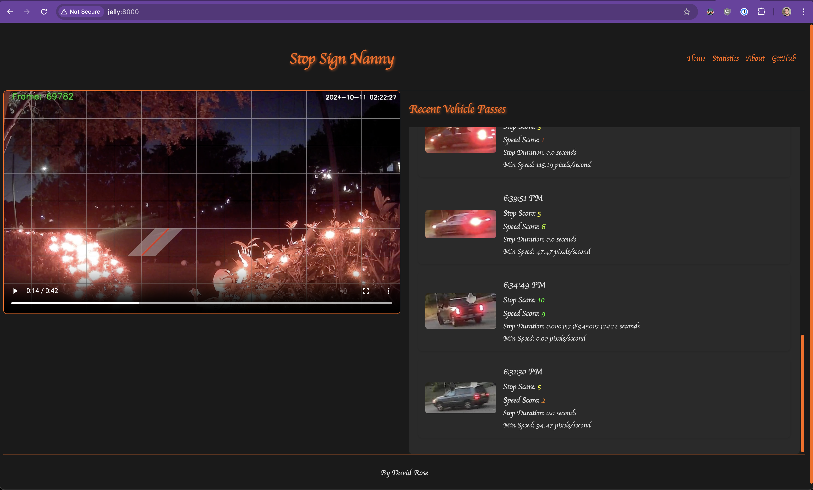

# stopsign_ai
Tracking stop sign behavior with a camera and AI

## Objective:

- **Monitor** a street intersection with a camera streaming video via RTSP.
- **Analyze** the feed in real-time using AI to detect vehicles and evaluate their stop sign behavior.
- **Store** processed images and metadata for each vehicle pass.
- **Display** recent vehicle passes and statistics on a web interface.

### Screenshot

## System Components and Flow

### 1. RTSP Stream Capture (`rtsp_to_redis.py`)
- **Function:** Captures video frames from the RTSP IP camera.
- **Process:**
  - Connects to the RTSP stream.
  - Encodes frames as JPEG.
  - Pushes frames to Redis.

### 2. Video Analysis (`video_analyzer.py`)
- **Function:** Processes frames from Redis, performs object detection, tracking, and stop sign behavior analysis.
- **Process:**
  - Retrieves frames from Redis.
  - Uses YOLO AI model for vehicle detection.
  - Tracks detected vehicles and analyzes their stop sign behavior.
  - Annotates frames and pushes to new Redis queue.
  - Stores metadata and images in SQLite.

### 3. FFmpeg Streaming (`ffmpeg_service.py`)
- **Function:** Converts processed frames into an HLS video stream for web display.
- **Process:**
  - Consumes annotated frames from Redis.
  - Feeds frames into FFmpeg to generate HLS stream.

### 4. Web Server (`web_server.py`)
- **Function:** Serves the web interface and live video stream.
- **Features:**
  - Displays live HLS video stream.
  - Shows recent vehicle passes with images and scores.
  - Integrates with Grafana for detailed statistics.

### 5. Monitoring and Metrics
- **Prometheus Integration:**
  - All services expose metrics to Prometheus for monitoring.
  - Metrics include frame processing times, FPS, memory usage, and more.
- **Grafana Dashboards:**
  - Visualize collected metrics for real-time monitoring and long-term trends.
